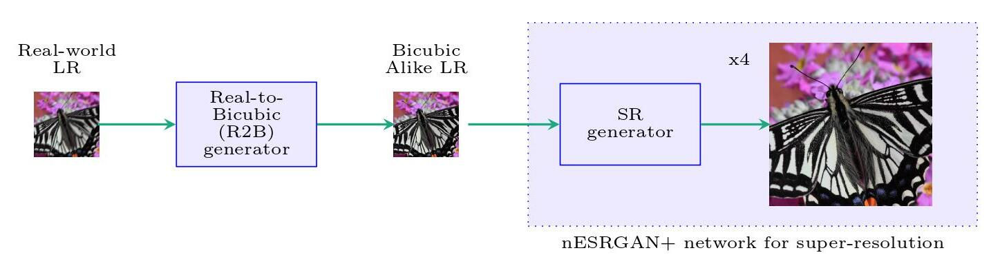
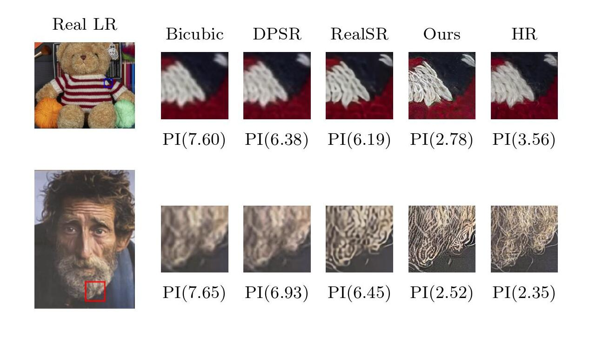

# GAN-Based Two-Step Pipeline For Real-World Image Super-Resolution


Official pytorch implementation of the paper [**GAN-Based Two-Step Pipeline For Real-World
Image Super-Resolution**](https://link.springer.com/chapter/10.1007/978-981-16-4177-0_75)

The overall pipeline is shown in the figure below:

<p align="left"><br>
Fig 1: A two-step pipeline for real-world image super-resolution. First, the R2B
generator transforms real-world LR images to bicubic alike images. Then the
nESRGAN+ network super-scales the output of the R2B generator by the scale
factor of 4.
</p>

# Prerequisites

- Python 3.8
- PyTorch 1.8
- CUDA 10.1

# Installation

First of all, clone the repo:
```bash
git clone https://github.com/rrgaire/Real-World-Image-SR
```
All the required python packages can be installed with:
```bash
cd Real-World-Image-SR
pip install -r requirements.txt
```

# Dataset

The datasets used are:
* [DIV2K](https://data.vision.ee.ethz.ch/cvl/DIV2K/)
* [RealSR Version 3](https://github.com/csjcai/RealSR)
* [DPED Cellphone](http://people.ee.ethz.ch/~ihnatova/)


# Config

Before training or testing each networks, make changes in the corresponding configuration files inside the `Config/` directory. The basic outline of the config files is given below:

```
config_*.yml
├──  path              - paths for pre-trained weights, logs, and validation checkpoint directories
│
├──  datasets 
│       └── train      - Training data configurations
│       └── valid      - Validation data configurations
│ 
├──  network_G         - Generator Network configurations
│ 
├──  network_D         - Discriminator Network configurations
│ 
└──  training details
        └── lr_G, lr_D - Learning rates for Generator and Discriminator
        └── b1, b2     - Values for β1 and β2 to use in Adam optimizer
        └── wt_pix     - Weight for Pixel Loss
        └── wt_fea     - Weight for Perceptual Loss
        └── wt_gan     - Weight for Adversarial Loss
        └── niter      - Total number of iterations to train
        └── val_freq   - Validation frequency

```

# Training

For R2B Network training:

```bash
cd R2B_Network
python train.py ../Configs/Train/config_r2b.yml
```

Similarly, for SR Network training:

```bash
cd SR_Network
python train.py ../Configs/Train/config_sr.yml
```
# Testing

For testing the whole pipeline, update `Config/Test/test_config.yml` with paths for trained model weights and image directories. Then run the following commands:

```bash
cd Real-World-Image-SR
python test.py Config/Test/test_config.yml
```

# Evaluate

To evaluate the networks, update the variables `SR_path` and `HR_path` in the `evaluate.py` file and run the following command:

```bash
python evaluate.py
```

# Results

<p align="center"><br>
Fig 2: Qualitative comparison of our proposed model with other state-of-the-art models on a subset of RealSR images. The value in the bracket indicates the Perceptual Index (PI) of the image.
</p>


# Citation
```bash
@InProceedings{10.1007/978-981-16-4177-0_75,
author="Gaire, Rebati Raman and Subedi, Ronast and Sharma, Ashim and Subedi, Shishir and     Ghimire, Sharad Kumar and Shakya, Subarna",
title="GAN-Based Two-Step Pipeline for Real-World Image Super-Resolution",
booktitle="ICT with Intelligent Applications",
year="2022",
publisher="Springer Singapore",
address="Singapore",
pages="763--772"
}
```